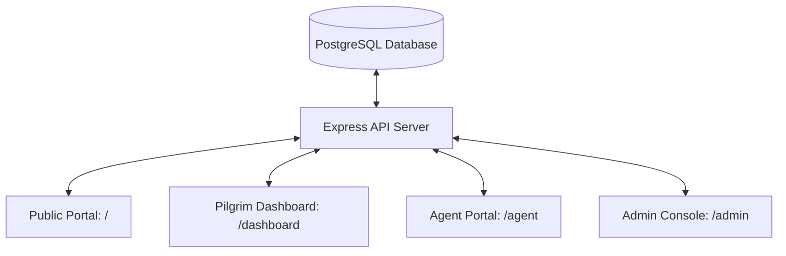
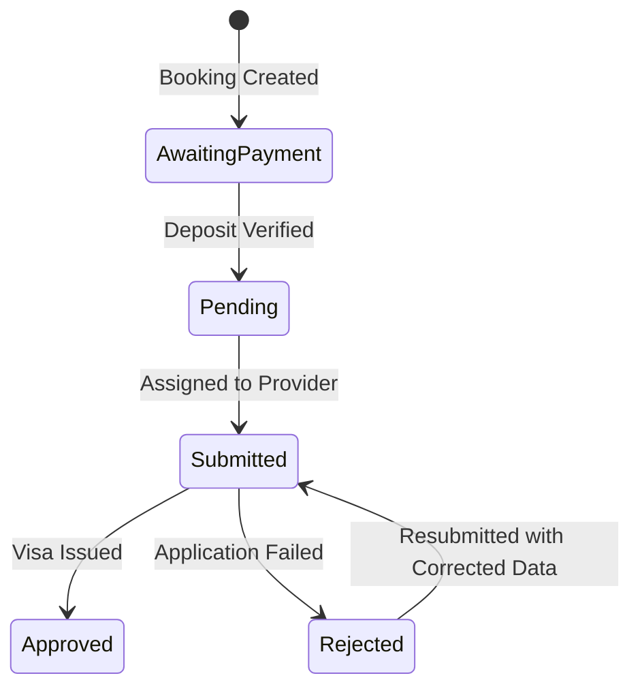

# Raudah Travels & Tours — Staff Operational Training Manual & Handbook

> **Document Classification:** Internal Staff Training & Operational Standard Operating Procedures (SOP)  
> **Applicable Version:** Raudah Platform Version 1.0 (Official Release)  
> **Licensing Compliance:** National Hajj Commission of Nigeria (NAHCON) & Saudi Ministry of Hajj & Umrah Regulations  
> **Issued:** October 2026  
> **PDF Training Guide:** [`docs/Raudah_Travels_Staff_Training_Manual.pdf`](file:///c:/Users/DEEPMIND/Downloads/Travel-Master-Guide-main/Travel-Master-Guide-main/docs/Raudah_Travels_Staff_Training_Manual.pdf)

---

## Executive Welcome & Mission

Welcome to the **Raudah Travels & Tours** team. As a premier NAHCON-licensed Hajj and Umrah travel operator headquartered in Kano and Abuja, Nigeria, our mission is to deliver a seamless, spiritually uplifting journey for every pilgrim.

The Raudah Web Application replaces manual WhatsApp messages, scattered paperwork, and fragile spreadsheets with an automated, synchronized, cloud-based platform. Every action you take in the Admin Console directly impacts our pilgrims' visas, flight confirmations, hotel arrangements, and financial records.

This handbook is your **step-by-step operational guide**. Whether you work at the **Front Desk**, **Visa Desk**, **Accounts & Finance**, **Logistics**, or **Customer Support**, this manual details exactly how to perform your daily tasks with zero errors.

---

## Table of Contents

1. [Module 1: System Architecture & Logging In](#module-1-system-architecture--logging-in)
2. [Module 2: Registration & Front-Desk Department](#module-2-registration--front-desk-department)
3. [Module 3: Passport & Document Verification Department](#module-3-passport--document-verification-department)
4. [Module 4: Visa Operations Department](#module-4-visa-operations-department)
5. [Module 5: Accounting & Finance Department](#module-5-accounting--finance-department)
6. [Module 6: Operations, Flights & Logistics Department](#module-6-operations-flights--logistics-department)
7. [Module 7: Customer Support & Team Communication](#module-7-customer-support--team-communication)
8. [Module 8: Super Admin & System Administration](#module-8-super-admin--system-administration)
9. [Module 9: Troubleshooting Guide & Escalation Matrix](#module-9-troubleshooting-guide--escalation-matrix)

---

## Module 1: System Architecture & Logging In

### 1.1 The Four System Portals

The Raudah platform is comprised of four unified portals sharing real-time data:

1. **Public Website (`/`)**: For marketing, package exploration, company information, public agent partnership applications, and contact inquiry intake.
2. **Pilgrim Self-Service Dashboard (`/dashboard`)**: Where pilgrims check booking progress, upload passport copies, track visa issuance, make Paystack payments, download travel documents, and open support tickets.
3. **Agent B2B Portal (`/agent`)**: Accredited partner travel agents manage registered pilgrim clients, track earned commissions, top-up and spend from their prepaid wallet, and view client e-visas.
4. **Admin Console (`/admin`)**: The internal management suite used by Raudah staff to handle registrations, vet passports, process visas, reconcile payments, print ID cards, and monitor company performance.

---

### 1.2 Access Levels & Security

Access is secured via **Clerk Authentication**. Every staff member is provided a corporate email address (`name@raudahtravels.com` or assigned email) and a temporary password generated by Super Admin.

| Role | Access Scope | Intended Departments | Key Restrictions |
|------|-------------|----------------------|------------------|
| `super_admin` | Total Unrestricted System Control | Directors, IT Lead, General Manager | Can configure site keys, delete records, view audit logs |
| `admin` | Operations & Department Management | Department Heads, Operations Managers | Cannot modify root API keys or delete staff accounts |
| `staff` | Role & Module Restricted Access | Front Desk, Visa Officers, Accountants, Ticketing | Strictly restricted to modules enabled by Super Admin |
| `agent` | Agent B2B Portal Only | External Accredited Travel Agencies | Can only access their own registered clients and wallet |

---

### 1.3 Logging In & Navigation Layout

1. Navigate to `/sign-in`.
2. Enter your work email and password.
3. Upon authentication, staff accounts are automatically directed to the **Admin Console** (`/admin`).
4. **The Navigation Sidebar** is organized into 5 operational categories:
   - **Main:** Overview Dashboard, Business Analytics, AI Assistant.
   - **Operations:** Packages, Bookings, Payments, Pilgrims Master List, Register Pilgrim Wizard.
   - **Pilgrims & Travel:** ID Tags Generator, Passports Review Queue, Visa Management, Booking Amendments, AI WhatsApp Registrations.
   - **Agents & Finance:** Agent Accounts, Company Bank Accounts.
   - **System:** User Accounts, Support Tickets, Website Enquiries, Team Chat, Staff Management, Audit Activity Log, Backup, Settings.

> [!TIP]
> **Sidebar Collapse Toggle:** On laptops or tablets, click the arrow toggle at the bottom of the sidebar to collapse the navigation into icons. This maximizes horizontal table space when viewing wide pilgrim manifests.

---

## Module 2: Registration & Front-Desk Department

**Primary Users:** Front-Desk Executives, Customer Service Representatives, Registration Officers.  
**Primary Screens:** `/admin/book-pilgrim`, `/admin/pilgrims`, `/admin/ai-registrations`, `/admin/bookings`.

---

### 2.1 The 5-Step Pilgrim Registration Wizard (`/admin/book-pilgrim`)

When a walk-in pilgrim or phone customer books a package, use the registration wizard to ensure complete regulatory compliance.

#### Step 1: Package & Trip Selection
- **Package:** Choose the target Hajj or Umrah package from active listings.
- **Departure Date:** Select the pilgrim's travel date. Note the airline and route.
- **Departure City:** Select the Nigerian airport of departure (e.g., Kano - MALLAM AMINU KANO INTL, Abuja - NNAMDI AZIKIWE INTL, Lagos - MURTALA MUHAMMED INTL).
- **Room Preference:** Select Single, Double, Triple, or Quad occupancy.
- **Agent Attribution:** If the pilgrim was referred or booked through a partner travel agent, select the agent from the dropdown.

#### Step 2: AI Passport OCR Scanner & Face Crop
- Click **"Upload Passport Image"** or select **"Camera"** if using a front-desk webcam.
- Select a clear, flat photo of the pilgrim's international passport data page.
- Google Gemini 1.5 Flash scans the machine-readable zone (MRZ) and automatically fills:
  - Passport Number
  - Surname and Given Names
  - Date of Birth
  - Passport Expiry Date
  - Gender and Nationality
- The system automatically detects the face bounding box and crops a **400×400 JPEG portrait photo** for the pilgrim profile and ID tags.
- *Manual Fallback:* If the passport image is creased, dirty, or low-resolution and OCR fails, type the fields manually.

#### Step 3: Personal & Mahram Compliance Details
- **Title / Civility:** Alhaji, Hajiya, Mal., Dr., Mr., Mrs.
- **Arabic Name:** Optional, for Saudi visa printing.
- **National Identification Number (NIN):** Mandatory for Nigerian travelers.
- **Marital Status & Occupation:** Enter current status.
- **Mahram Requirement (CRITICAL):**
  - According to Saudi consular rules, female pilgrims under the age of 45 traveling without special waivers must be registered with a recognized male relative (Mahram) traveling on the same package.
  - Select the Mahram pilgrim from the dropdown and select the relationship (Husband, Father, Brother, Son, Uncle).

#### Step 4: Contact & Next of Kin
- **Pilgrim Contact:** Phone number (include +234 country code) and email.
- **Home Address:** Full street address, State of origin, and LGA.
- **Emergency Next of Kin:** Full Name, Relationship, and a reachable 24/7 emergency phone number.

#### Step 5: Payment & Registration Voucher
- **Payment Method:** Cash, Bank Transfer (attach teller/screenshot), or Paystack online.
- **Initial Installment:** Enter the amount deposited today.
- Click **"Confirm Booking"**.
- The system immediately:
  1. Generates a unique Booking Reference (e.g. `RD-2026-UMR-0089`).
  2. Generates an instant printable **Booking Confirmation Slip**.
  3. Sends an automated email confirmation to the pilgrim.

---

### 2.2 Batch Registration for Families & Groups

For tour groups, corporate contingents, or large families:
1. In `/admin/book-pilgrim`, click **"Batch Passport Upload"**.
2. Select up to **20 passport images** simultaneously.
3. The AI engine parses all passports in parallel.
4. Review the generated table: verify names, passport numbers, and dates of birth.
5. Select a single shared package, travel date, and departure city for the entire group.
6. Click **"Register All Pilgrims"**. All records are generated in a single transaction with linked references.

---

### 2.3 Master Pilgrim Directory (`/admin/pilgrims`)

The Pilgrim Directory is your central database of all registered travelers:
- **Search & Filter:** Search by name, passport number, phone number, booking reference, departure city, or package.
- **In-Place Editing:** Click the pencil icon on any cell to update passport numbers, room preferences, or phone numbers without opening slow full-page forms.
- **Exporting Manifests:**
  - Click **"Export to Excel"** to download official manifests.
  - Formats supported: Standard Internal Manifest, NAHCON Submission Format, and Saudi e-Track Consular Format.
- **Package Transfers:** If a pilgrim requests to move to a different departure date or package, click **"Transfer Package"** from the action menu.

---

### 2.4 AI WhatsApp & Telegram Registration Queue (`/admin/ai-registrations`)

Pilgrims can initiate bookings via WhatsApp and Telegram chatbots:
1. Navigate to `/admin/ai-registrations`.
2. Inspect pending registrations: view the uploaded passport image alongside AI-extracted fields.
3. Check the **Duplicate Status Badge**: The system alerts you if the passport number already exists (`possible_duplicate` or `duplicate_confirmed`).
4. Click **"Approve"** to convert the bot chat into an active booking.

---

## Module 3: Passport & Document Verification Department

**Primary Users:** Consular Documentation Officers, Compliance Assistants.  
**Primary Screens:** `/admin/passports`, `/admin/pilgrims`.

---

### 3.1 The 6-Month Expiry Rule & The Passports Queue (`/admin/passports`)

> [!WARNING]
> **Saudi Consular Law:** Any pilgrim whose passport expires in less than 6 months from their scheduled departure date will be rejected by the Saudi Visa portal and denied flight boarding.

The Passports Review Queue categorizes every passport automatically:

| Visual Badge | Status | Definition | Protocol |
|--------------|--------|------------|----------|
| 🟢 Green (Shield) | **Valid** | Passport valid > 6 months from flight date | Cleared for visa processing queue |
| 🟠 Orange (Clock) | **Expiring Soon** | Passport expires within 3 to 6 months | **URGENT:** Call pilgrim to renew passport immediately |
| 🔴 Red (Alert) | **Expired** | Passport already expired or expires < 3 months | **BLOCK:** Do not submit for visa. Mark as ineligible |
| ⚪ Grey (File) | **Missing Doc** | Booking exists but no passport photo uploaded | Follow up with pilgrim or agent for document upload |

---

### 3.2 Passport Quality Checklist Before Visa Submission

Before clearing any passport for visa submission, verify that the scan satisfies these 5 criteria:
1. **MRZ Legibility:** The two bottom lines containing `P<NGA...` must be sharp and unbroken.
2. **Glare-Free:** No white camera flash reflection obscuring the date of birth or passport number.
3. **Full Page Boundary:** All four physical corners of the passport booklet must be visible in the image.
4. **Valid Signature:** The passport must be signed by the holder where applicable.
5. **No Cropping of Face:** The photo in the passport must be crisp and recognizable.

---

### 3.3 Batch Downloading Passports for NAHCON / Consulates

When sending a batch of passports to the Saudi embassy, NAHCON, or an airline:
1. Filter the `/admin/passports` list by Package and Departure Date.
2. Click **"Select All"** (or check specific approved pilgrims).
3. Click **"Download Selected Passports"**.
4. The system packages all high-resolution scans into a single compressed `.ZIP` file named by package and date (`Umrah_Easter_2026_Passports.zip`).

---

## Module 4: Visa Operations Department

**Primary Users:** Visa Officers, Consular Liaison Managers.  
**Primary Screens:** `/admin/visa-management`.

---

### 4.1 The Five-Stage Visa Pipeline

Track every visa application through these exact stages:

1. **Awaiting Payment (Purple Badge):** The pilgrim has booked, but their required deposit or payment has not been confirmed by Accounting. **Do not process visas for unpaid bookings.**
2. **Pending (Orange Badge):** Payment is confirmed and passport is verified. Ready for visa provider allocation.
3. **Submitted (Blue Badge):** The passport data has been uploaded to the Saudi visa system or dispatched to an external partner.
4. **Approved (Green Badge):** The visa has been granted. Enter Visa Number, Expiry Date, and upload the e-Visa PDF.
5. **Rejected (Red Badge):** Rejection by Saudi authorities (e.g. active existing visa, prior overstay, blacklisted name, incorrect biodata). Record the rejection reason immediately.

---

### 4.2 Managing External Visa Providers

In `/admin/visa-management` -> **Visa Providers Tab**:
- Register visa companies and agencies partnering with Raudah.
- Add contact person, direct phone, and specializations (e.g. *Umrah Nusuk Direct*, *B2B Group Quotas*, *Tourist e-Visas*).
- When submitting a batch of pilgrims, select the designated provider so your team knows which agency holds each passport.

---

### 4.3 Uploading Issued Visas & Flight Tickets (The Closing Workflow)

When an issued e-visa or flight ticket is received:
1. In `/admin/visa-management`, search for the pilgrim by Passport Number or Reference.
2. Click **"Update Visa"**.
3. Enter the **Visa Number** and **Visa Expiry Date**.
4. Click **"Upload Visa Document"** and attach the official PDF.
5. Click **"Upload Flight Ticket"** and attach the airline ticket PDF.
6. Change status to **"Approved"** and click **"Save Changes"**.
7. **Immediate Result:**
   - The pilgrim's dashboard status changes to *Visa Issued*.
   - A download button appears in the pilgrim's portal.
   - If registered through an agent, the agent sees the approved visa in `/agent/visas`.

---

## Module 5: Accounting & Finance Department

**Primary Users:** Finance Managers, Accountants, Cashiers, Billing Clerks.  
**Primary Screens:** `/admin/payments`, `/admin/bank-accounts`, `/admin/agents`.

---

### 5.1 Verifying Manual Bank Transfers

When a pilgrim or agent makes an offline bank deposit or mobile transfer:
1. Navigate to `/admin/payments`.
2. Locate transactions labeled **"Pending"** with payment method **"Bank Transfer"**.
3. Click the transaction to inspect the uploaded payment proof (transfer receipt, teller, or banking app screenshot).
4. **Bank Reconciliation:** Log in to Raudah's corporate banking portal (Stanbic IBTC, Jaiz Bank, Zenith Bank, etc.) and confirm that:
   - The funds have cleared into the company account.
   - The sender name or transfer narration matches the booking.
   - The amount received matches or exceeds the stated amount.
5. If verified: Click **"Verify Payment"**. The booking updates to confirmed, and the pilgrim's outstanding balance decreases.
6. If disputed or uncredited: Click **"Reject Payment"** and enter a note (e.g., *"Receipt unconfirmed on bank statement as of 11:30 AM"*).

---

### 5.2 Managing Outstanding Balances & Installments

In `/admin/payments` -> **Outstanding Balances Tab**:
- Monitor total accounts receivable, total received, and balance owed across all packages.
- **Recording Manual Payments:**
  - Click **"Record Payment"** next to any pilgrim.
  - Enter the amount paid.
  - Select method: Cash, Bank Transfer, POS Card, or Bank Draft.
  - Enter the receipt reference.
  - Check *"Mark as Verified"* if funds are physically in hand.
  - Click **"Save Payment"**.

---

### 5.3 Printing Official Payment Receipts

After recording any payment:
- Click the printer icon (**"Print Receipt"**) on the payment row.
- The system renders an official Raudah Travels & Tours receipt:
  - Corporate Header with RC Number and NAHCON License.
  - Booking Reference, Pilgrim Name, and Package Type.
  - Amount Paid, Payment Date, and Payment Method.
  - **Remaining Balance Due** and Payment Schedule.
- Print directly to 80mm thermal receipt printers or standard A4 office printers.

---

### 5.4 Agent Wallet Top-Ups & Commission Payouts

In `/admin/agents`:
- **Prepaid Wallet Top-Up:**
  - When an agent transfers funds to Raudah to credit their B2B wallet:
  - Find the agent -> Click **"Top-Up Wallet"**.
  - Enter the amount and bank deposit reference.
  - Confirm authorization. The agent's wallet balance increases instantly.
- **Double-Entry Wallet Ledger:**
  - Every transaction (client booking deduction, refund, or top-up) is recorded in the permanent audit ledger with operator ID and timestamps.
- **Commission Settlement:**
  - Track total accrued commission per agent. Mark settlements as paid once transferred to the agent's commercial bank account.

---

## Module 6: Operations, Flights & Logistics Department

**Primary Users:** Operations Managers, Logistics Coordinators, Tour Guides.  
**Primary Screens:** `/admin/packages`, `/admin/id-tags`, `/admin/amendments`.

---

### 6.1 Creating & Managing Travel Packages (`/admin/packages`)

When launching a new Hajj season or Umrah group:
1. Click **"Create Package"**.
2. **Package Name:** e.g., *"Ramadan VIP Umrah 2026 - Last 10 Days"*.
3. **Type:** Hajj, Umrah, Visa Only, Ticket Only, or Custom.
4. **Base Pricing & Deposit:** Set Total Package Price (in NGN) and minimum initial deposit.
5. **Flight Dates & Hijri Calendar:**
   - Set Departure Flight Date, Airline, and Flight Route (e.g. `KAN -> JED`).
   - Set Return Flight Date and Return Route (e.g. `MED -> KAN`).
   - Specify the corresponding Islamic Hijri dates for pilgrim clarity.
6. **Room Surcharges:** Specify additional fees for Single Room, Double Room, or Triple Room upgrades.
7. **Live Countdown Timer:** Enable the countdown banner to show days/hours remaining until registration closes.

---

### 6.2 Generating Printable Pilgrim ID Tags with QR Codes (`/admin/id-tags`)

Every pilgrim must wear an official Raudah badge throughout their journey in Saudi Arabia:
1. In `/admin/id-tags`, select the package and flight group.
2. Select all pilgrims to generate tags in bulk.
3. **Automated Tier Styling:**
   - **Gold Tier:** Premium & VIP Packages.
   - **Silver Tier:** Standard & Luxury Packages.
   - **Royal Indigo Tier:** Economy Packages.
4. **Badge Features:**
   - High-contrast pilgrim photo.
   - Pilgrim Full Name, Passport Number, and Unique Pilgrim ID.
   - Package Name, Hotel Name (Makkah & Madinah), and Departure City.
   - Emergency contact numbers in Nigeria and Saudi Arabia.
   - **Dynamic QR Code:** Scanning the code with any smartphone camera immediately opens the pilgrim's verified emergency record, hotel location, and group leader phone.
5. Click **"Print ID Tags"** or **"Download PDF"** for A6 badge lamination.

---

### 6.3 Handling Pilgrim Amendment Requests (`/admin/amendments`)

When a pilgrim requests a change to their booking (e.g., room change from Quad to Double, updated contact number, or flight date shift):
1. Navigate to `/admin/amendments`.
2. Inspect the request: review the **Old Value** vs. **Requested New Value**.
3. If approved: The booking record automatically updates, and any applicable price adjustments are recalculated in the pilgrim's payment ledger.
4. If rejected: Provide a clear explanation (e.g., *"Single rooms are completely sold out for this flight"*).

---

## Module 7: Customer Support & Team Communication

**Primary Users:** Customer Support Representatives, Operations Staff.  
**Primary Screens:** `/admin/support`, `/admin/enquiries`, `/admin/chat`.

---

### 7.1 Support Ticket Routing & SLA Management

Support tickets opened by pilgrims in their dashboard are routed by category:

| Ticket Category | Assigned Department | Typical Issues | Target Response SLA |
|-----------------|---------------------|----------------|---------------------|
| `payment_issues` | Accounting & Finance | Bank transfer status, receipt requests | **Under 2 Hours** |
| `visa_processing` | Visa Operations Desk | Document re-upload, visa issuance inquiries | **Under 4 Hours** |
| `flights_transport` | Flight Logistics | Airport terminal, luggage rules, seat changes | **Under 4 Hours** |
| `booking_issues` | Front Desk / Registration | Name spelling corrections, Mahram changes | **Under 3 Hours** |
| `general_inquiry` | Customer Care | Hotel distances, vaccine rules, itinerary | **Under 6 Hours** |

- Staff assigned to specific **Support Specialties** in their user profile receive these tickets directly in their queue.
- Use threaded replies to communicate with the pilgrim. When resolved, mark ticket as **"Resolved"**.

---

### 7.2 Internal Team Chat Channels (`/admin/chat`)

To ensure real-time coordination without information loss on external chat apps:
- `#flights-transport`: Flight delay alerts, bus charter coordination, airport arrivals.
- `#visa-processing`: Saudi portal maintenance notifications, biometric updates.
- `#finance-billing`: High-value transfer verification, refund approvals.
- `#accommodation`: Hotel room allocations, room key distribution in Makkah & Madinah.
- `#emergency`: Urgent medical situations or lost pilgrims in Saudi Arabia.
- **Direct Messaging:** For private 1-on-1 operational handoffs between colleagues.

---

## Module 8: Super Admin & System Administration

**Primary Users:** Managing Directors, IT Lead, Super Administrators.  
**Primary Screens:** `/admin/staff`, `/admin/activity`, `/admin/ai`, `/admin/backup`, `/admin/settings`.

---

### 8.1 Staff Account Provisioning & Granular Permissions (`/admin/staff`)

1. Click **"Add Staff Member"**.
2. Enter Full Name, Email, and generate a strong temporary password.
3. Select Role: `Admin` or `Staff`.
4. **Assign Granular Page Permissions:** Check only the modules relevant to their job:
   - Registration Staff: `overview`, `packages`, `bookings`, `pilgrims`, `register_pilgrim`, `ai_registrations`.
   - Visa Staff: `overview`, `pilgrims`, `passports`, `visa_management`.
   - Accounting Staff: `overview`, `bookings`, `payments`, `bank_accounts`, `agents`.
5. Select their **Support Specialties** to route customer tickets automatically.
6. Click **"Save Staff Member"**.

---

### 8.2 Security Audit Logs (`/admin/activity`)

Every significant action taken in the system is logged immutably:
- Staff Name & Email
- Exact Action (e.g. `VERIFY_PAYMENT`, `UPDATE_VISA_STATUS`, `DELETE_BOOKING`)
- Target Record & Change Details
- IP Address & Timestamp

---

### 8.3 AI Business Assistant (`/admin/ai`)

Super Admins can ask questions about live operations in natural language:
- *"How many pilgrims have unpaid balances on the Easter Umrah package?"*
- *"What is our total revenue collected for Hajj 2026 this month?"*
- *"List all pilgrims departing from Kano without an approved visa."*
The assistant analyzes the live database and returns structured tables and summaries.

---

## Module 9: Troubleshooting Guide & Escalation Matrix

### 9.1 Common Operational Issues & Quick Fixes

| Symptom | Probable Cause | Immediate Corrective Action |
|---------|----------------|-----------------------------|
| **Passport OCR Fails to Extract Data** | Blurry photo, reflection on MRZ zone, or camera tilt | Ask pilgrim for a clear, flat, well-lit photo. If urgent, type fields manually. |
| **Pilgrim Cannot Download Visa PDF** | Status was set to approved, but PDF file was not attached | Open Visa Management -> Click Update Visa -> Upload the official e-Visa PDF -> Click Save. |
| **Bank Transfer Payment Stays Pending** | Finance staff have not reconciled bank statement | Finance team must confirm credit in corporate bank account before verifying. |
| **Agent Unable to Book Client** | Agent's prepaid wallet balance is lower than package price | Agent must transfer funds to Raudah corporate account and request a wallet top-up. |
| **Session Expired / Blank Page** | Inactivity timeout on Clerk authentication | Refresh the page and log in again at `/sign-in`. |

---

### 9.2 Emergency Escalation Contacts

For critical incidents (server downtime, passport mismatches at the airport, emergency consular escalations):

- **IT Systems & Portal Administration:** `it@raudahtravels.com` / Internal Chat `#emergency`
- **Head of Consular & Visa Affairs:** `visa@raudahtravels.com`
- **Head of Finance & Operations:** `finance@raudahtravels.com`
- **Head Office:** City Scape / Shariff Plaza, Block A No. 208A First Floor, Alexandria Crescent, Wuse 2, Abuja, Nigeria.
- **Customer Hotline:** 08036264607, 08034803504

---

*End of Operational Training Manual — Raudah Travels & Tours*
